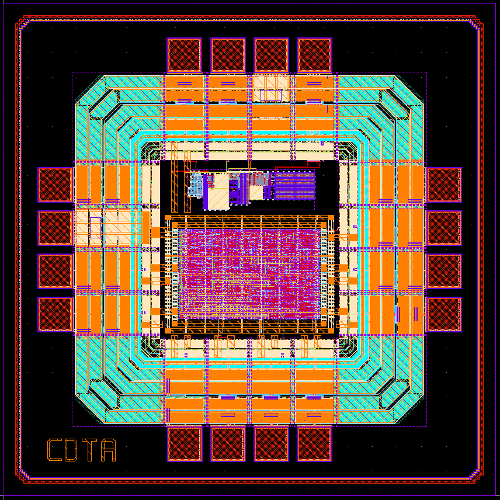

# SoC9692

Single-technology IP library.

- doc/     : user documentation
- dependencies/ : sub-cells and blocks
- release/v.1.0.0 : immutable versioned deliveries

# SoC9692



| | |
|---|---|
| **Category** | Mixed-Signal SoC |
| **Technology** | IHP SG13G2 |
| **Top Cell** | `SoC9692` |
| **Die Size** | 1 mm × 1 mm |
| **License** | Apache-2.0 |

---

## Overview

SoC9692 (PV-TMS) is a photovoltaic temperature management system on chip that uses the SG13G2 IHP 130nm technology node.

## Application

PV-TMS can be used for a variety of applications, including but not limited to:
- Solar panel cooling systems
- Data center monitoring
- Aeronautics and aerospace
- Worn medical devices
- Battery monitoring

### Features

- **Hysteresis** - Digital comparator with threshold hysteresis for precise temperature monitoring
- **Binary output** — Single bit output for simple and flexible control
- **UART interface** - Universal interface, allowing users to control threshold values and test the chip
- **Functional DFT** - Functional tests done via UART

---

### Prerequisites

- [IHP SG13G2 Open PDK](https://github.com/IHP-GmbH/IHP-Open-PDK)
- [LibreLane](https://github.com/efabless/librelane)
- [Icarus Verilog](http://iverilog.icarus.com/)

## License

Licensed under the [Apache License 2.0](https://www.apache.org/licenses/LICENSE-2.0).

```

Licensed under the Apache License, Version 2.0 (the "License");
you may not use this file except in compliance with the License.
You may obtain a copy of the License at

    http://www.apache.org/licenses/LICENSE-2.0
```

